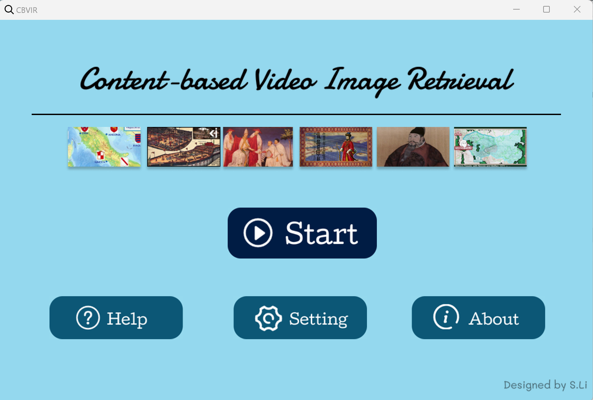
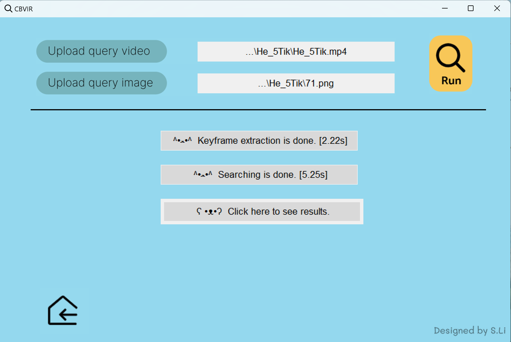
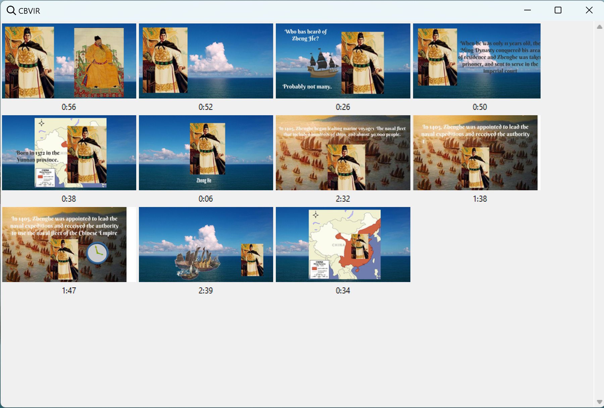
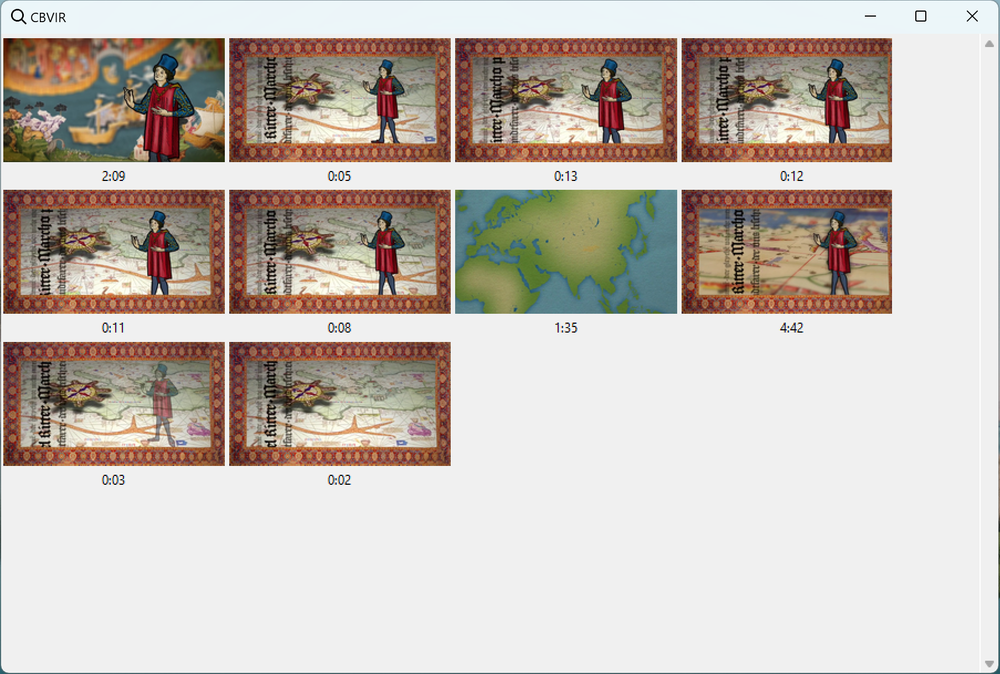
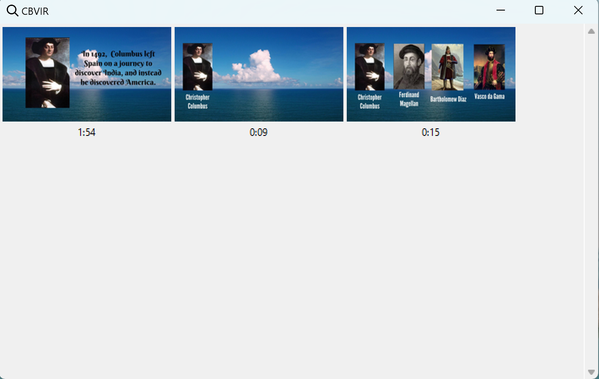

# CBVIR
> A demo video [_here_]([https://youtu.be/NiWZC823nag]).

## Table of contents
* [General info](#general-information)
* [Overall scheme](#overall-scheme)
* [GUI prototype](#gui-prototype)

## General information
**Full name:** Content-based Video Image Retrieval System (CBVIR-S)

**Introduction:** CBVIR-S is a system that retrieves a given query image from a given video, also providing the temporal indices of corresponding retrieval results. The autors are Master students in TU Delft EEMCS. The testing dataset of CBVIR-S is provided by Andrea Natetti in Nanyang Technological University, School of Art, Design and Media. And the codes are released under MIT License. The MIT License grants users the right to use, copy, modify, merge, distribute and sublicense, free of charge.

## Overall scheme

  
 
<ins><b><i> Illustration of the decomposed scheme </i></b></ins>

### KFE module
#### Setup
- Create a virtual environment

`cd /home/user/myproject`

`python3 -m venv /path/to/new/virtual/environment`

- Activate the virtual environment

`source /path/to/new/virtual/environment/bin/activate`

(To deactivate, simply use command `deactivate`)

- Install the required packages

`pip install env_list.txt`

- Run in the command line:
  
  For color-based features `python3 color-based/main_multiplevideo.py`
  
  For DL-based features `python3 DL_based_KFE.py`
  
  Or click run button.

### CBIR module

## GUI prototype
To use the GUI prototype, you can open the file "demo.py" in "CBVIR_GUI" and run it. 

By simply uploading your query image and video, you will get the temporal location of the target image. 

   
 
<ins><b><i> Prototype interface screenshots </i></b></ins>

   
  
   
  
   
  
 
<ins><b><i> Example results </i></b></ins>

If the performance of certain image and video pair is not satisfactory, you could also adjust the "similarity threshold" in utils/KFE_module or "thr" in utils/CBIR_module. These two parameters will be adjustable in "Settings" in the GUI prototype in the near future. :)

## Recycling scheme

   
 
<ins><b><i> Illustration of the recycling scheme </i></b></ins>

