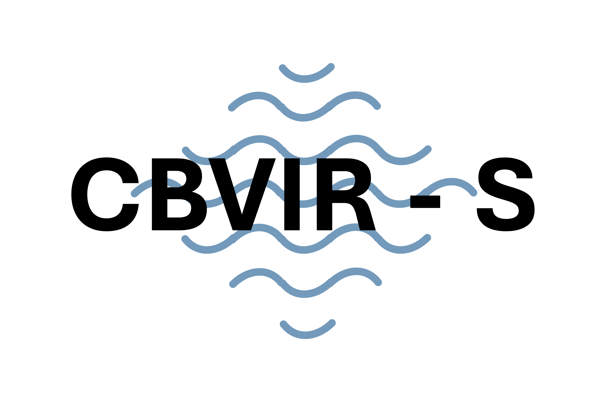

<a name="readme-top"></a>

<!-- PROJECT LOGO -->
<br />
<div align="center">
  <a href="https://github.com/LotusCreme/CBVIR">
    
  </a>

  <p align="center">
    An efficient visual content retrieval model
    <br />
<!--     <a href="https://github.com/othneildrew/Best-README-Template"><strong>Explore the docs »</strong></a>     <br />
    <br /> -->
    <a href="https://www.youtube.com/watch?v=yOIuuZTh_Qc">Watch Intro Video</a>
    ·
    <a href="https://github.com/LotusCreme/CBVIR/issues">Report Issues</a>
    ·
    <a href="#how-to-use">How to use</a>
  </p>
</div>

<!-- TABLE OF CONTENTS -->
<details>
  <summary>Table of Contents</summary>
  <ol>
    <li><a href="#general-information">General info</a></li>
    <li><a href="#model-pipeline">Model pipeline</a></li>
    <li><a href="#how-to-use">How to use</a>
      <ul>
          <li><a href="#kfe-module">KFE module</a></li>
      </ul>
      <ul>
          <li><a href="#cbir-module">CBIR module</a></li>
      </ul>
    </li>
    <li><a href="#gui-prototype">GUI prototype</a></li>
    <li><a href="#other-notes">Other Notes</a></li>
    <li><a href="#license">License</a></li>
    <li><a href="#contact">Contact</a></li>
    <li><a href="#acknowledgments">Acknowledgments</a></li>
  </ol>
</details>

<!--
## Table of contents
* [General info](#general-information)
* [Overall scheme](#overall-scheme)
* [Use Guide](#how-to-use)
* [GUI prototype](#gui-prototype)
-->

## General information
**Full name:** Content-based Video Image Retrieval System (CBVIR-S)

**Introduction:** CBVIR-S is a system that retrieves a given query image from a given video, also providing the temporal indices of corresponding retrieval results. The autors are Master students in TU Delft EEMCS. And this project is related to our Master's theses. You could also check out our theses via following links:

- [x] Sinian Li: http://resolver.tudelft.nl/uuid:d16300c5-6988-4172-8c20-0e2dfff8949f
- [x] Doruk Barokas Profeta: http://resolver.tudelft.nl/uuid:751092b8-1b3d-4335-98bd-cc26e69d374c

**Note** One of the testing datasets of CBVIR-S: Historical figures, is provided by Andrea Natetti in Nanyang Technological University, School of Art, Design and Media. 

<p align="right">(<a href="#readme-top">back to top</a>)</p>


## Model pipeline

<p align="center">
  
<br>
<ins><b><i> Illustration of the decomposed scheme </i></b></ins>
</p>

<p align="right">(<a href="#readme-top">back to top</a>)</p>


## How to use
### KFE module
#### Setup
- Create a virtual environment

```
cd /home/user/myproject
```

```
python3 -m venv /path/to/new/virtual/environment
```

- Activate the virtual environment

```
source /path/to/new/virtual/environment/bin/activate
```

(To deactivate, simply use command `deactivate`)

- Install the required packages

```
pip install env_list.txt
```

#### Run
- Run in the command line:
  
  For color-based features:
  ```
  python3 color-based/main_multiplevideo.py
  ```
  
  For DL-based features:
  ```
  python3 DL_based_KFE.py
  ```
  
  Or click run button if you are using VScode.

<p align="right">(<a href="#readme-top">back to top</a>)</p>

### CBIR module
**Installation Guideline:**

To run the system, first clone the repository. To install the correct packages, change the directory to the folder that contains the environment.yml file, build the environment, and install packages by using the following command:

```
conda env create -f environment.yml
```

Next, download the solar global model that can be found [here](https://imperialcollegelondon.box.com/shared/static/fznpeayct6btel2og2wjjgvqw0ziqnk4.pth). Move the downloaded model to the following folder: 

```
../Efficient-CBVIR/featureextraction/solar/data/networks/
```

<p align="right">(<a href="#readme-top">back to top</a>)</p>

## GUI prototype
To use the GUI prototype, you can open the file `demo.py` in `CBVIR_GUI` and run it. (The environment is the same as KFE module, see the guide above)

1. By clicking the `Start` button, we can go to the upload page.
2. Uploading your query image and video can be done simply by clicking the corresponding buttons, navigating to their desired files within their folders, and selecting the target image and video.
3. You should click the `Run` button after successfully uploading the items.
4. As the processing commences, informative labels will appear to indicate the progress.
5. Then, you will be able to access the results by clicking the `Click to See Results` button, and you will get the temporal location of the target image. 

<p align="center">
   
<br>
<ins><b><i> Prototype interface screenshots </i></b></ins>
</p>

<p align="center">
  <br>
  
  <br>
  
  <br>
  
<br>
<ins><b><i> Example results </i></b></ins>
</p>


If the performance of certain image and video pair is not satisfactory, you could also adjust the **similarity threshold** in `utils/KFE_module` or **thr** in `utils/CBIR_module`. 


<p align="right">(<a href="#readme-top">back to top</a>)</p>

## Other Notes
### ENGINEERING HISTORICAL MEMORY (EHM)
<div align="center">
  <a href="https://engineeringhistoricalmemory.com">
    
  </a>
</div>

EHM is an amazing digital history gallery with diverse visualization solutions and interactive exploration options. **Dr. Andrea Nanetti from NTU** first theorised Engineering Historical Memory (EHM) when he was Visiting Scholar at Princeton University in 2007. The first EHM tests on highly cross-linked historical data have been published in Italy in 2008 (local urban historical memory transmission), 2010 (global  views and networks), and 2011 (regional man-heritage-landscape systems). These pioneering research and publication projects are at the basis of the subsequent and related digital humanities projects run by the EHM international initiative.

For more information, please visit [https://engineeringhistoricalmemory.com](https://engineeringhistoricalmemory.com)

<p align="right">(<a href="#readme-top">back to top</a>)</p>

### Recycling scheme
This is a baseline scheme to recycle the previously extracted features in two stages to save time for the whole processing, but building and choosing suitable network faces challenges. Because, meeting the requirements for efficient features in the KFE stage and for smart and comprehensive features for the CBIR stage to guarantee accuracy with one kind of feature is not suitable.

<p align="center">
   
<br>
<ins><b><i> Illustration of the recycling scheme </i></b></ins>
</p>

<p align="right">(<a href="#readme-top">back to top</a>)</p>

<!-- LICENSE -->
## License

Distributed under the MIT License. See `LICENSE.txt` for more information.

<p align="right">(<a href="#readme-top">back to top</a>)</p>


<!-- CONTACT -->
## Contact

Sinian Li - [@Email address](lixiaoxiao0124@gmail.com) - lixiaoxiao0124@gmail.com

Doruk Barokas Profeta - [@Email address](barokasdoruk@gmail.com) - barokasdoruk@gmail.com

Project Link: [https://github.com/LotusCreme/CBVIR](https://github.com/LotusCreme/CBVIR)

<p align="right">(<a href="#readme-top">back to top</a>)</p>


<!-- ACKNOWLEDGMENTS -->
## Acknowledgments

We would like to express our sincere appreciation to Dr. Andrea Nanetti for his support in this project in dataset preparation and the meticulous construction of the historical dataset, which greatly enhanced the quality of our research.

<p align="right">(<a href="#readme-top">back to top</a>)</p>
